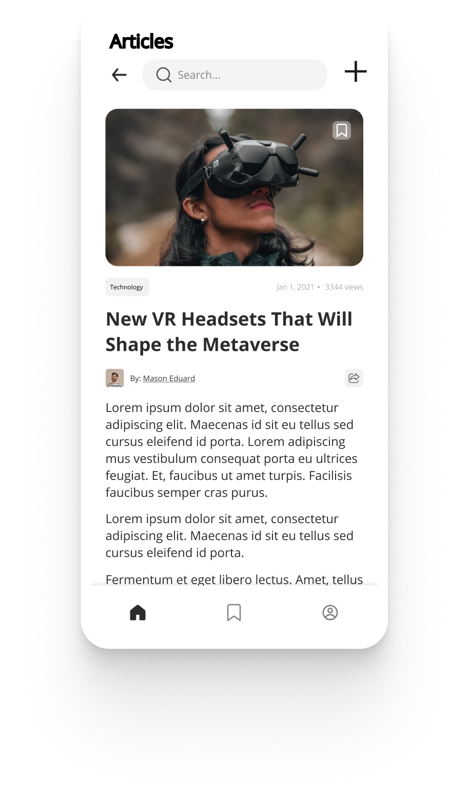
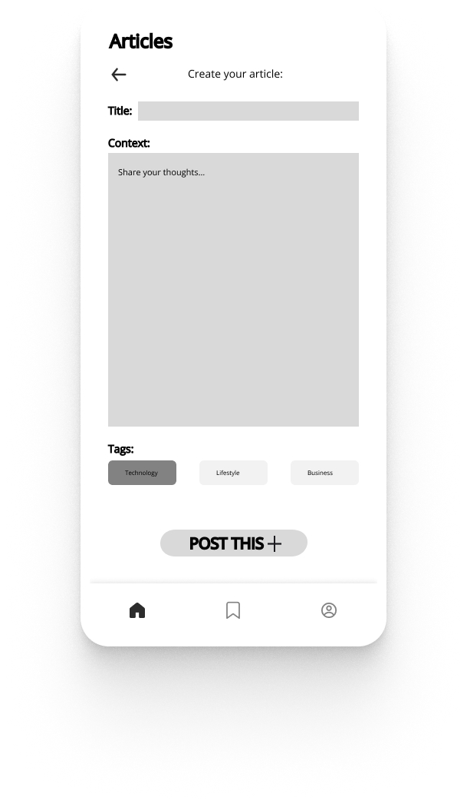

# Mobile Article Posting Platform

## Project Description

This mobile application allows users to create, edit, and view articles on a platform similar to Medium. Users can easily share their thoughts, ideas, and knowledge by publishing posts that can be viewed by others. The platform is designed for both casual readers and active contributors. The app supports content management, including the ability to create, update, and delete articles, providing a seamless experience whether the user is online or offline.

---

## Domain Details

The main entity in this application is the **Article**. Each article has the following fields:

1. **Title** (String)  
   - The headline or name of the article that users will see. It should be concise and catchy.

2. **Content** (Text)  
   - The full body of the article. Users can write their stories, tutorials, or any other form of content here.

3. **Author** (String)  
   - The name of the user who created the article.

4. **Published Date** (DateTime)  
   - The date and time when the article was published on the platform.

5. **Tag** (String)  
   - Keyword or label assigned to the article for categorization (e.g., "Technology", "Science").

---

## CRUD Operations

### 1. Create

- **Action**: A user can create a new article by filling out the title, content, tag, and other necessary fields.
- **Client-Side**: The article creation form is displayed, and the user inputs are stored temporarily.
- **Server-Side**: Once the user saves the article, the data is sent to the server and persisted in the database.
- **Offline Scenario**: If the user is offline, the article is stored locally on the device and automatically uploaded when the connection is restored.

### 2. Read

- **Action**: Users can view a list of articles and open individual articles to read the full content.
- **Client-Side**: Articles are fetched from the local database or server.
- **Server-Side**: When the app is online, it fetches the latest articles from the server.
- **Offline Scenario**: If offline, the app retrieves previously cached articles from the local database, allowing users to read without an internet connection.

### 3. Update

- **Action**: A user can edit an article they previously created by modifying the title, content, or tags.
- **Client-Side**: The update form is pre-filled with the current article data, allowing the user to make changes.
- **Server-Side**: Updated data is sent to the server and stored in the database once the user saves their changes.
- **Offline Scenario**: If the user is offline, the changes are stored locally and synchronized with the server when the connection is restored.

### 4. Delete

- **Action**: A user can delete an article they no longer want to be displayed on the platform.
- **Client-Side**: The user confirms the deletion.
- **Server-Side**: The article is permanently removed from the server-side database.
- **Offline Scenario**: If offline, the article is flagged for deletion locally, and the deletion will be processed on the server once the connection is restored.

---

## Persistence Details

### Local Database
The following CRUD operations are persisted locally:
1. **Create**: Articles created while offline are saved locally and synced when back online.
2. **Read**: Previously viewed articles are cached for offline reading.
3. **Update**: Edits to articles made while offline are saved locally and synced when back online.

### Server Database
The following CRUD operations are persisted on the server:
1. **Create**: New articles are uploaded to the server and stored in the central database.
2. **Update**: Changes made to articles are sent to the server when online.
3. **Delete**: Articles are removed from the server-side database when deleted.

---

## Offline Scenarios for CRUD Operations

### Create (Offline)
- When a user creates a new article while offline, the article is saved locally. Once the app detects an active internet connection, it will automatically upload the article to the server.

### Read (Offline)
- Articles that were previously viewed are stored in the local database, enabling users to read them even if they lose internet connectivity. No new articles will be available until the connection is restored.

### Update (Offline)
- When a user edits an article offline, the changes are saved locally. Once reconnected, the app will synchronize the updates with the server to ensure the changes are reflected across all users.

### Delete (Offline)
- Deleting an article while offline will flag the article for deletion. The deletion will be processed and completed once the internet connection is restored.

---

## Mockups

Below are mockups of the app screens created using Figma.

1. **List View**: Displays a list of articles with titles and brief information.
 
2. **Read Screen**: Allows users to read a specific article as well as save or share it.

3. **Add Screen**: Allows users to write an article as well as choose a title and a tag.

